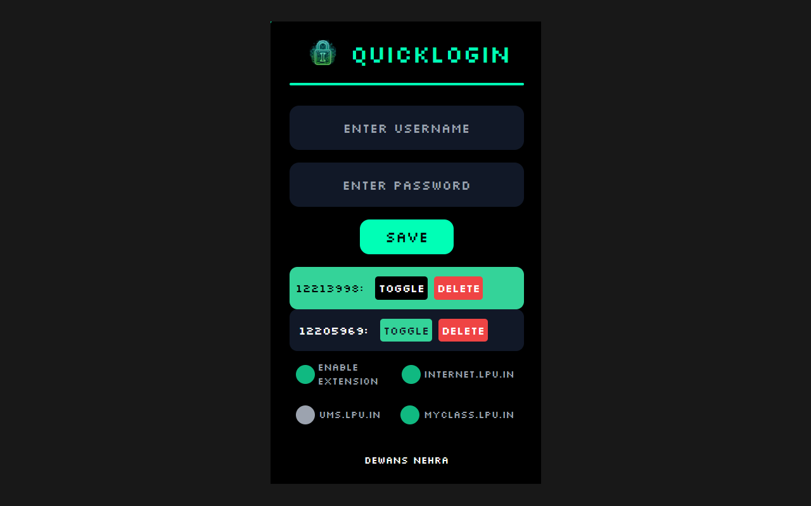

# QuickLogin

## Description

QuickLogin is a Chrome extension that automatically logs you into Internet.lpu.in, ums.lpu.in, and myclass.lpu.in.

## Author

Dewans Nehra

## Homepage

[https://dewansnehra.xyz](https://dewansnehra.xyz)

## Features

- Automatically fills in your login credentials on Internet.lpu.in, ums.lpu.in, and myclass.lpu.in.
- Saves your login credentials for future use.
- Allows you to manually update your saved login credentials.

## Installation

1. Download the extension as a .zip by clicking the green "Code" button on this GitHub repository, then choose "Download ZIP".
2. Unzip the file on your computer.
3. Open Google Chrome and go to the Extensions page (`chrome://extensions`).
4. Enable Developer Mode by clicking the toggle switch in the top right corner of the Extensions page.
5. Click the "Load unpacked" button and select the unzipped folder for this extension to install it.

## Usage

1. After installing the extension, click on its icon in the Chrome toolbar.
2. Enter your login credentials for Internet.lpu.in, ums.lpu.in, and myclass.lpu.in.
3. Click the "Save" button.
4. The next time you visit any of these websites, the extension will automatically fill in your saved login credentials.

## Icons

## License

This project is licensed under the terms of the MIT license.